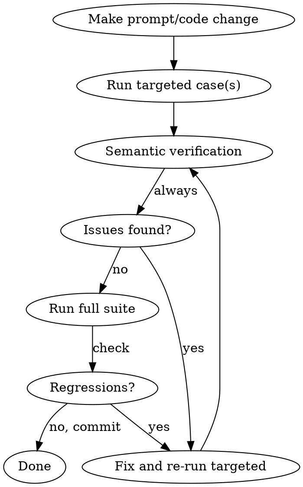

# Planner Eval

Run and verify planner/patcher eval cases for the clickweave LLM pipeline.

## Location

- **Binary:** `cargo run -p clickweave-llm --features eval --bin planner_eval`
- **Cases:** `crates/clickweave-llm/eval/cases/*.toml`
- **Config:** `crates/clickweave-llm/eval/eval.toml` (gitignored, copy from `eval.toml.example`)
- **Results:** `crates/clickweave-llm/eval/results/` (gitignored)
- **Patcher prompt:** `crates/clickweave-llm/src/planner/prompt.rs` (`patcher_system_prompt` fn)
- **Planner prompt:** `crates/clickweave-llm/prompts/planner.md`

## Workflow



### 1. Run targeted case(s) first

Never start with the full suite. Test only the cases affected by your change:

```bash
cargo run -p clickweave-llm --features eval --bin planner_eval -- --case "extend" --runs 3
```

Flags: `--case <substring>`, `--runs N`, `--model <name>`, `--concurrency N`

### 2. Semantic verification (CRITICAL — do not skip)

Pass/fail scores check node count, required tools, forbidden tools, and patterns. They do NOT verify:
- **Node ordering** — are steps in the right sequence?
- **Argument correctness** — do click targets, text values, app names make sense?
- **Edge wiring** — do conditionals branch correctly? Do loops contain the right body?
- **Prompt compliance** — does "before X" actually come before X?

Extract and review node sequences from the results JSON:

```python
# Parse results and print topo-sorted node sequences per case
import json
from collections import defaultdict, deque

with open('path/to/results.json') as f:
    data = json.load(f)

for case in data['cases']:
    for ri, run in enumerate(case['runs']):
        # Build topo order from edges, print node names + types
        ...
```

Check every case for semantic correctness, not just structural pass.

### 3. Run full suite for regressions

Only after targeted cases pass semantic review:

```bash
cargo run -p clickweave-llm --features eval --bin planner_eval
```

Compare node counts across runs — identical counts (e.g., `7,7,7`) indicate deterministic output. Variance (e.g., `11,8,8`) may signal prompt ambiguity.

### 4. When adding patcher prompt rules

Concrete examples are critical for consistency. The pattern that works:
1. Add the rule (e.g., "use remove+add to insert before")
2. Run targeted — often gets ~2/3 compliance
3. Add a concrete JSON example showing the exact patch format
4. Re-run — should get 3/3

See the redirect example and insert-before example in `patcher_system_prompt` for reference.

## Case Format

Cases use `[[turns]]` for multi-turn support:

```toml
name = "My eval case"

[[turns]]
prompt = "Open Calculator, calculate 5 times 6"
[turns.expect]
min_nodes = 4
max_nodes = 8
required_tools = ["launch_app", "click"]
forbidden_tools = ["cdp_click", "cdp_type_text", "cdp_press_key", "cdp_hover", "cdp_fill", "cdp_navigate", "cdp_new_page", "cdp_close_page", "cdp_select_page", "cdp_handle_dialog", "cdp_wait_for", "fill", "navigate_page", "new_page", "close_page", "select_page", "handle_dialog", "wait_for"]

[[turns]]
prompt = "Also take a screenshot"
[turns.expect]
min_nodes = 5
max_nodes = 9
required_tools = ["launch_app", "click", "take_screenshot"]
forbidden_tools = ["cdp_click", "cdp_type_text", "cdp_press_key", "cdp_hover", "cdp_fill", "cdp_navigate", "cdp_new_page", "cdp_close_page", "cdp_select_page", "cdp_handle_dialog", "cdp_wait_for", "fill", "navigate_page", "new_page", "close_page", "select_page", "handle_dialog", "wait_for"]
```

- `forbidden_tools` — tools that must NOT appear in the workflow (enforces CDP vs native tool selection)
- Native cases forbid all `CDP_ACTION_TOOLS`; CDP cases forbid all `NATIVE_ACTION_TOOLS` (see `tool_use.rs`)
- A drift test ensures forbidden_tools entries stay in sync with the canonical constants

Turn 1 = plan from scratch. Turn 2+ = patch existing workflow.

## Multi-Endpoint Config

```toml
# Weighted distribution across servers
[[llm.endpoints]]
url = "http://server-a:8000/v1/chat/completions"
weight = 3

[[llm.endpoints]]
url = "http://server-b:8000/v1/chat/completions"
weight = 1
```

Each endpoint gets its own concurrency semaphore — a slow/dead endpoint won't starve others. Results JSON records which endpoint handled each run.

## Common Mistakes

| Mistake | Fix |
|---------|-----|
| Running full suite first | Run `--case` targeted, then full suite |
| Trusting pass/fail only | Always do semantic verification of node sequences |
| Updating eval expectations to match broken output | Default assumption: code is wrong, not the test |
| Adding patcher rules without examples | Concrete JSON examples are required for consistent compliance |
| Forgetting to check multi-turn ordering | T2+ patches can silently append instead of insert — verify order |
